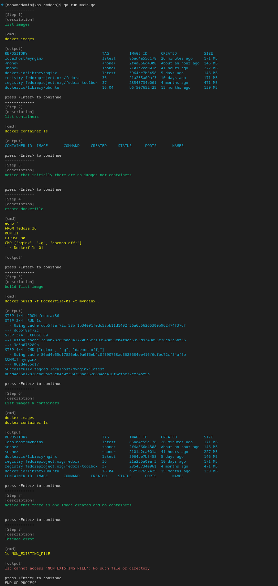

# CmdGen
Helps attendees in workshops.

From a description of workshop steps:
- generates bash script with comments
- or start scenario in cli

It can be extended for other usecases

- [CmdGen](#cmdgen)
- [How it works ?](#how-it-works-)
  - [generate bash script from yaml description](#generate-bash-script-from-yaml-description)
  - [start scenario](#start-scenario)
- [Example](#example)
  - [generate bash script](#generate-bash-script)
  - [start scenario](#start-scenario-1)
- [What's next ?](#whats-next-)


# How it works ?
## generate bash script from yaml description
It generates bash script based on go-template.
``` go-template
#!/bin/bash

{{ range .Items }}
  {{- range (split .Description) -}}
    {{- printf "# %s\n" . }}
  {{- end -}}
  {{- println .Cmd }}
{{ end }} 
```
## start scenario
Start scenario step by step

# Example
``` yaml
# ./files/test.yaml
---
-
  description: list images
  cmd: docker images
-
  description: list containers
  cmd: docker container ls
-
  description: notice that initially there are no images nor containers
  cmd: ''
-
  description: create dockerfile
  cmd: |-
    echo '
    FROM fedora:36
    RUN ls
    EXPOSE 80
    CMD ["nginx", "-g", "daemon off;"]
    ' > Dockerfile-01
-
  description: build first image
  cmd: docker build -f Dockerfile-01 -t mynginx .
-
  description: List images & containers
  cmd: |-
    docker images
    docker container ls
-
  description: Notice that there is one image created and no containers
  cmd: ""
-
  description: Inteded error
  cmd: ls NON_EXISTING_FILE
```

## generate bash script
``` golang
// main.go
package main

import "cmdgen/cmd/cmdgen"

func main() {
	cmdgen.StartScenario("files/test.yaml")
}
```

``` bash
[mohamedamin@xps cmdgen]$ go run main.go
[mohamedamin@xps cmdgen]$ cat script.bash 
#!/bin/bash

# list images
docker images

# list containers
docker container ls

# notice that initially there are no images nor containers


# create dockerfile
echo '
FROM fedora:36
RUN ls
EXPOSE 80
CMD ["nginx", "-g", "daemon off;"]
' > Dockerfile-01

# build first image
docker build -f Dockerfile-01 -t mynginx .

# List images & containers
docker images
docker container ls

# Notice that there is one image created and no containers


# Inteded error
ls NON_EXISTING_FILE

 

```

## start scenario
``` golang
// main.go
package main

import "cmdgen/cmd/cmdgen"

func main() {
	cmdgen.StartScenario("files/test.yaml")
}
```




# What's next ?
- Add other parameters to command structure
- Add option to prune/clean environment
- Add Makefile
- Automate binary creation
- Update Doc
- Cover more unit tests